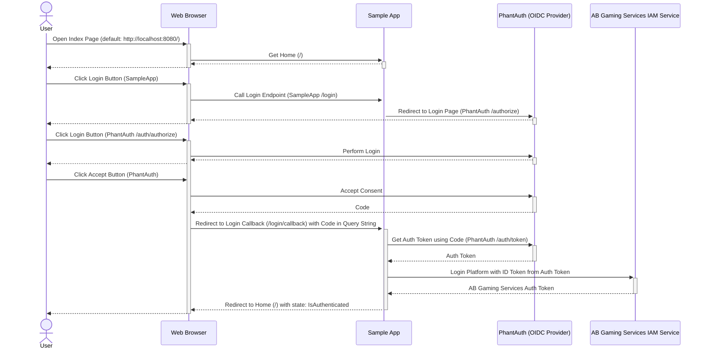

# AccelByte Gaming Services and 3rd Party OpenID Connect Login Integration Using AccelByte Python Extend SDK

## Overview

AccelByte Gaming Services provides [integration with OpenID Connect providers](https://docs.accelbyte.io/guides/access/3rd-party-platform-integration.html#openid-connect) as one of the 3rd party login integration options. Any OpenID Connect providers should work. The following sample app will show you how to do this with the AccelByte Python Extend SDK and [PhantAuth](https://www.phantauth.net/), an OpenID Connect provider to simplify testing.

## Sample App

1. Clone [AccelByte Python Extend SDK](https://github.com/AccelByte/accelbyte-python-sdk) 
2. Go to the [samples/oidc/single-page-app](https://github.com/AccelByte/accelbyte-python-sdk/tree/main/samples/oidc/single-page-app) folder
3. Follow the [README.md](https://github.com/AccelByte/accelbyte-python-sdk/blob/main/samples/oidc/single-page-app#readme) to setup and use the sample application

## How It Works

1. On sample app index page, when the `Login` button is clicked:
    - The SampleApp Login endpoint (`/login`) is called which then --
    - Redirects user to Phantauth Login and Consent page (`/auth/authorize`)
2. After user is done with `Phantauth` Login and Consent page, SampleApp `/login/callback` endpoint is called by `PhantAuth` with `code` in query string
3. In `/login/callback` endpoint: 
    - Get auth token from `PhantAuth` with `code` from the query string
    - Perform login platform using `Platform ID` and `ID Token` from `PhantAuth` auth token
    - After login platform is successful, we can try to call some AccelByte Gaming Services endpoints



## Code Walktrough

### app.py

#### `main()` or `run()`

1. Configure app using command-line arguments.
2. Initialize Accelbyte Python SDK.
3. Run app.

```python
# app.py

def run(
    *,
    host: str,
    port: int,
    debug: bool,
    env: str,
    secret_key: str,
    with_pkce: bool,
    **kwargs,
) -> None:
    # (1.)
    if debug:
        logger.setLevel(logging.DEBUG)
        logger.addHandler(logging.StreamHandler())

    app.config.update(
        {
            "SECRET_KEY": secret_key,
            "WITH_PKCE": with_pkce,
        }
    )

    # (2.)
    ab.initialize(
        options={
            "config": "DotEnvFileConfigRepository",                            # Loads config repository values from the argument 'dotenv_file'.
            "config_params": ([], {"dotenv_file": env, "set_env_var": True}),  # Setting 'set_env_var' to 'True' will also set the values found
        }                                                                      #   in the 'dotenv_file' as environment variables. (os.environ)
    )

    # (3.)
    app.run(host=host, port=port, debug=debug)


# (0.)
if __name__ == "__main__":
    run(**parse_args())
```

#### Endpoint `/` (Home)

```python
# app.py

@app.route("/")
def home():
    return render_template("home.html")
```

#### Template `home.html`

```html
<!-- home.html -->

<html>
<head>
    <title>Single Page App</title>
</head>
<body>
    <div id="content">
        
        <div>
            <p>Welcome back User {{ current_user.id }}!</p>
        </div>

        <form method="get" action="logout">
            <button id="logout-button" class="btn btn-primary" type="submit">Logout</button>
        </form>
        
        <div>
            <p>Hello!</p>
        </div>

        <form method="get" action="login">
            <button id="login-button" class="btn btn-primary" type="submit">Login</button>
        </form>
        
    </div>
</body>
</html>
```

#### Endpoint `/login`

1. Redirect user to the PhantAuth Login and Consent page (`/auth/authorize`).

```python
# app.py

@app.route("/login")
def login():
    # (1.)
    query_params = {
        "client_id": os.environ["OIDC_CLIENT_ID"],
        "redirect_uri": os.environ["APP_REDIRECT_ENDPOINT"].format(
            base_url=request.url_root.removesuffix("/")
        ),
        "response_type": "code",
        "scope": "openid",
    }

    if app.config.get("WITH_PKCE", False):
        pkce = ab_core.create_pkce_verifier_and_challenge_s256()
        (
            _,
            code_challenge,
            code_challenge_method,
        ) = pkce
        query_params["code_challenge"] = code_challenge
        query_params["code_challenge_method"] = code_challenge_method
        app.config.update(pkce=pkce)
        logger.info(pkce)

    location = os.environ["OIDC_AUTHORIZE_ENDPOINT"].format(
        base_url=os.environ["OIDC_BASE_URL"].removesuffix("/"),
        query_params=urllib.parse.urlencode(
            query=query_params,
        ),
    )

    return redirect(location=location)
```

#### Endpoint `/login/callback`

1. Get `code` from the redirect URL query string.
2. Get auth `token` from the OIDC provider using `code` (`/auth/token`).
3. Get `id_token` from the `token`.
4. Perform AccelByte Python SDK `login_platform` using Platform ID (from the `env CLI argument` and environment variables) and `id_token` from PhantAuth token.
5. After `login_platform` is successful, we can now begin calling AccelByte Gaming Services endpoints.

```python
# app.py

@app.route("/login/callback")
def login_callback():
    # (1.)
    authorization_code = request.args["code"]

    # (2.)
    form_data = {
        "redirect_uri": os.environ["APP_REDIRECT_ENDPOINT"].format(
            base_url=request.url_root.removesuffix("/")
        ),
        "client_id": os.environ["OIDC_CLIENT_ID"],
        "client_secret": os.environ["OIDC_CLIENT_SECRET"],
        "grant_type": "authorization_code",
        "code": authorization_code,
    }

    if app.config.get("WITH_PKCE", False):
        (
            code_verifier,
            _,
            _,
        ) = app.config["pkce"]
        form_data["code_verifier"] = code_verifier
        app.config.update(pkce=None)

    response = requests.post(
        url=os.environ["OIDC_TOKEN_ENDPOINT"].format(
            base_url=os.environ["OIDC_BASE_URL"].removesuffix("/"),
        ),
        data=form_data,
    )

    response.raise_for_status()

    # (3.)
    oidc_token = response.json()

    logger.info(json.dumps(oidc_token, indent=2))

    id_token = oidc_token["id_token"]

    # (4.)
    ab_token, error = auth_service.login_platform(
        platform_id=os.environ["AB_PLATFORM_ID"], platform_token=id_token
    )
    if error is not None:
        error_value = error.to_dict() if hasattr(error, "to_dict") else str(error)
        return jsonify(error=error_value), 404

    ab_token = ab_token.to_dict()

    logger.info(json.dumps(ab_token, indent=2))

    ab_user_id = ab_token["user_id"]

    user = User.get(ab_user_id)
    if not user:
        user = User.create(ab_user_id)

    login_user(user)

    return redirect(location=url_for("home"))  # (5.)
```

#### Endpoint `/logout`

```python
# app.py

@app.route("/logout")
def logout():
    logout_user()
    return redirect(location=url_for("home"))
```
